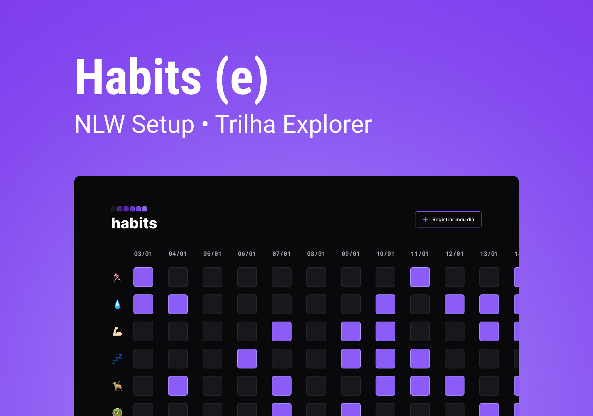

<h1 align="center"> Habits </h1>

<h3 align="center">NLW é um evento exclusivo e gratuito. promovido pela Rocketseat para ensino de tecnologias WEB.  
</h3>

  

## 🚀 Tecnologias

Esse projeto foi desenvolvido com as seguintes tecnologias:

- HTML e CSS
- JavaScript
- Figma
- Git e Github

## 💻 Projeto

O Habits é um app para ajudar a rastrear os hábitos.

## 📝 Layout

Você pode Visualizar o layout do projeto através [DESSE LINK](https://www.figma.com/community/file/1195327109778210238). É necessário ter conta no [Figma](https://figma.com) para acessá-lo.

